# vue_webapp_music
该项目是一个基于vue2.5开发，仿网易云音乐手机客户端的前端项目(开发)
采用技术有：vue全局桶+axios+JS+css+H5+less

PS:在此特别感谢**Binaryify大佬做的后端api**，在此基础上我调用完成了前端页面


该项目需要后端api依赖,安装如下:
```
git clone git@github.com:Binaryify/NeteaseCloudMusicApi.git 

npm install
```
运行：

```
node app.js
```

## Project setup
首先需要安装依赖
```
npm install
```

启动项目
```
npm run serve
```

### Compiles and minifies for production
打包项目
```
npm run build
```

项目部分功能预览：

项目还在**开发中**

#### 项目首页

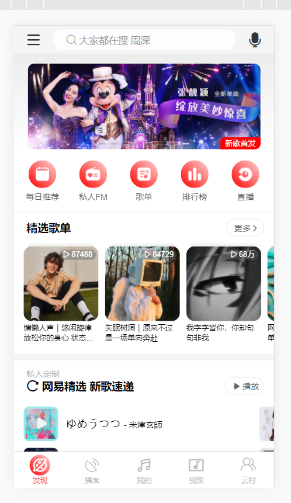

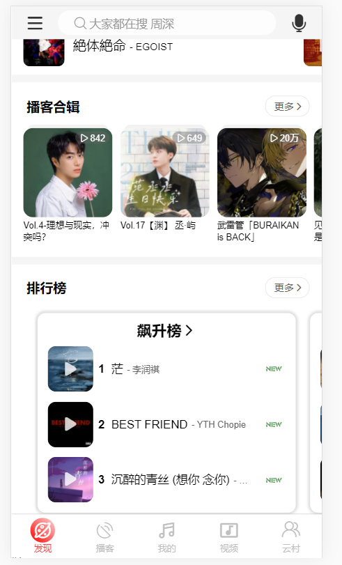

#### 搜索功能页面

可以对单曲，歌单，视频，歌手，专辑，用户进行搜索

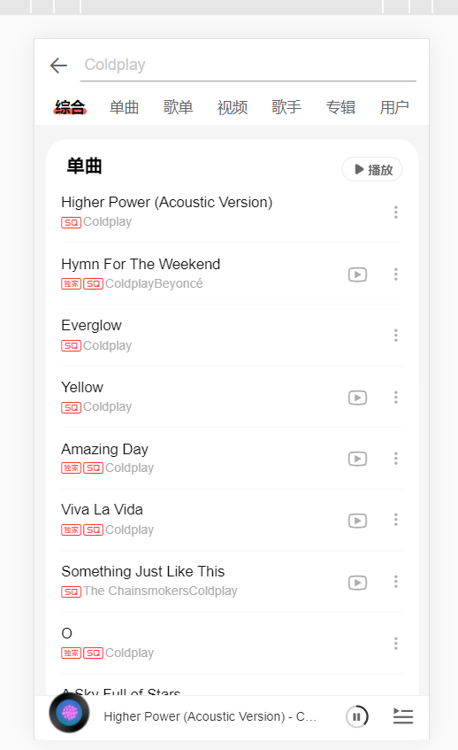

#### 歌单页面

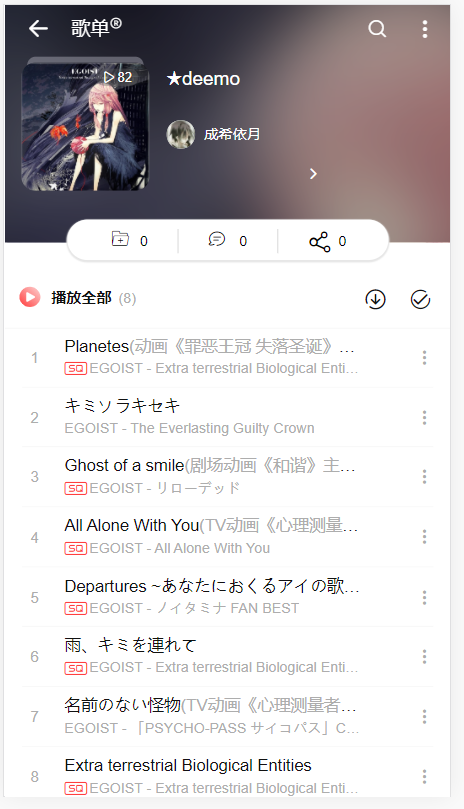

#### 登陆界面

可采用登陆方式有：

1. 手机号+密码登陆
2. 手机号+验证码
3. 邮箱+密码

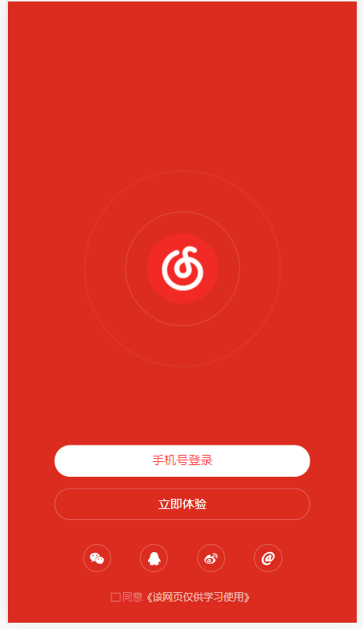

#### 用户个人界面

​	用户未登陆前

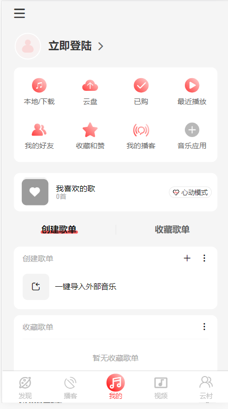

​	用户登陆后

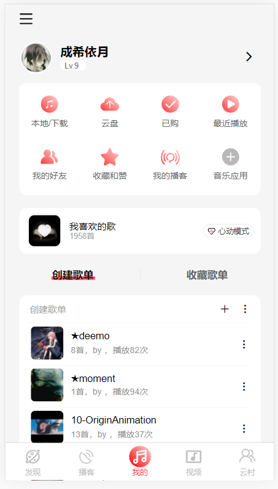

#### 音乐播放器界面

功能特点：

 	1. 通过类似轮播图原理，可以滑动专辑以达到切换歌曲的目的
      	2. 音乐进度条可以拖动
         	3. 点击音乐封面显示歌词


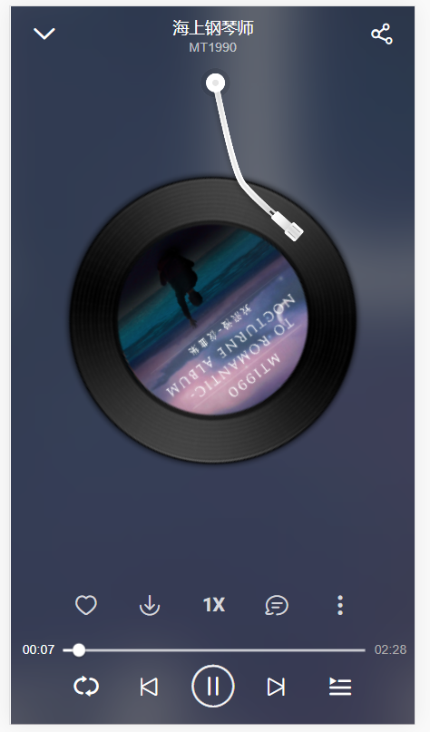

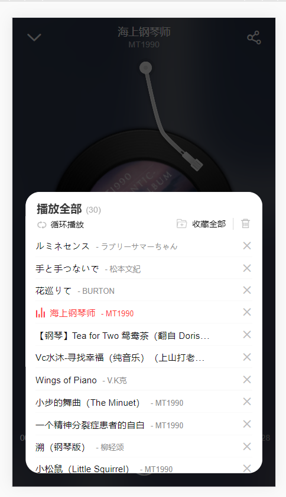

#### 歌曲评论界面


#### mini播放器

​	功能特点：圆形进度条，可以点击控件来播放或者暂停歌曲

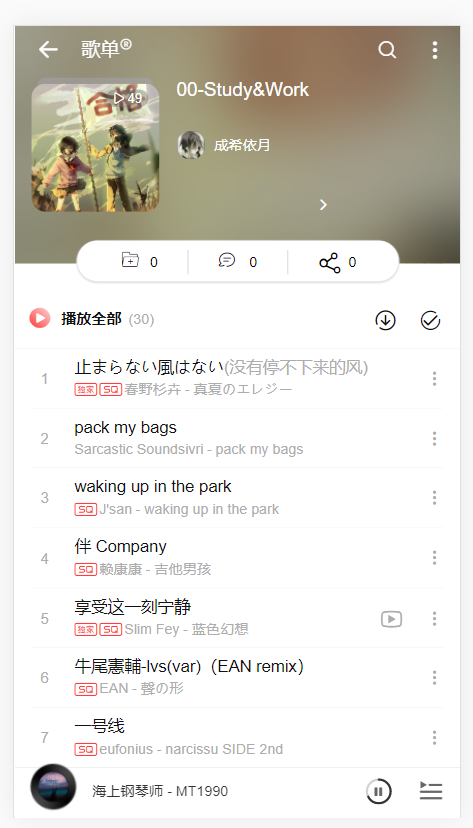

#### 播客页面展示


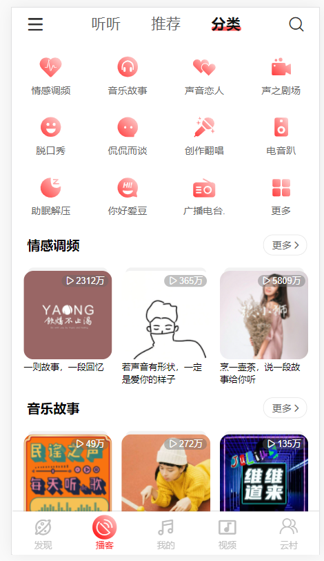

#### 视频页面展示

ps：该页面样式开发尚不完整，可以观看视频，但用户**需要先登陆**，否则无法获得数据

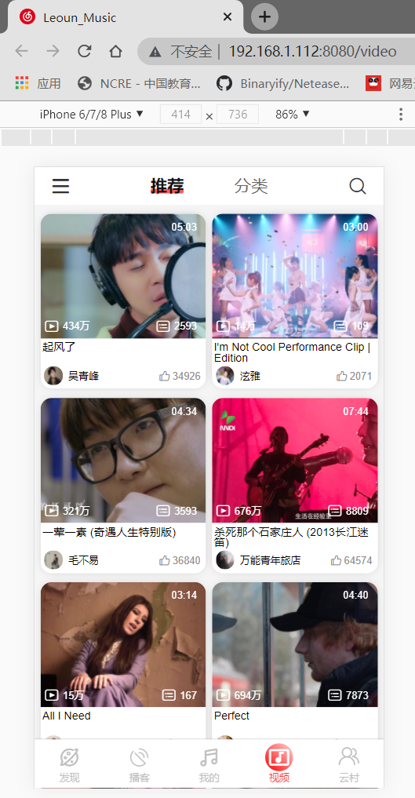